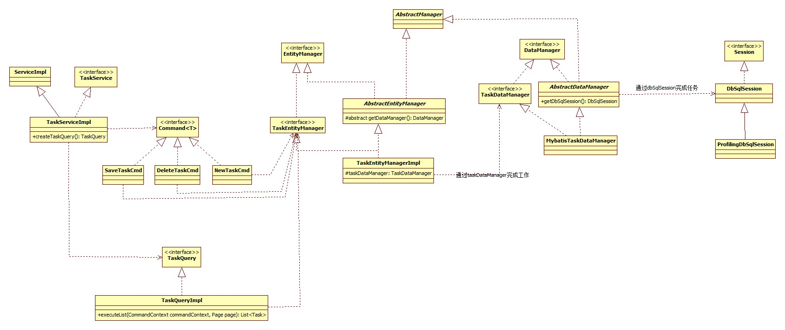

#Activiti——Task源码解析

###整体类图


###整体分析
**
1：TaskService是Activiti的操作Task的API。通过类图可以看到其实现TaskServiceImpl依赖于Command和TaskQuery。
2：Task部分有很多Command实现，类图上只举了一些示例。这些Command的具体实现依赖于TaskEntityManager来实现其功能。
3：TaskQuery相当于一个参数的传递者，其连接了TaskService和TaskEntityManager之间的数据传递。TaskService创建TaskQuery实例，TaskQuery收集参数，TaskEntityManager通过TaskQuery获取参数，进行查询。
4：TaskEntityManager是Task部分任务的接收者，对Task的所有操作最终都会经过TaskEntityManager
5: TaskEntityManager相当于一个静态代理，其代理TaskDataManager，所有的实际操作都由TaskDataManager来完成。
6：TaskDataManager的操作最终通过DbSqlSession操作MyBatis的api完成。
**
---

###一、TaskService和Command、TaskQuery之间的依赖

**TaskServiceImpl部分源码：**
```java
  public Task newTask(String taskId) {
    return commandExecutor.execute(new NewTaskCmd(taskId));
  }

  public void saveTask(Task task) {
    commandExecutor.execute(new SaveTaskCmd(task));
  }
  ......
  省略部分代码
  ......
  public TaskQuery createTaskQuery() {
    return new TaskQueryImpl(commandExecutor, processEngineConfiguration.getDatabaseType());
  }
```
>**Tips**
>1: TaskServiceImpl对Task的CUD操作都是由TaskCmd来实现，依赖于TaskCmd
>2: TaskServiceImpl对Task的查询操作通过创建TaskQuseryImpl的查询实例，来收集查询参数
---

###二、Command、TaskQueryImpl对TaskEntityManager的依赖

**DeleteTaskCmd源码**
```java
public class DeleteTaskCmd implements Command<Void>, Serializable {
    ......
    省略部分代码
    ......
  public Void execute(CommandContext commandContext) {
    if (taskId != null) {
      deleteTask(commandContext, taskId);
    } else if (taskIds != null) {
      for (String taskId : taskIds) {
        deleteTask(commandContext, taskId);
      }
    } else {
      throw new ActivitiIllegalArgumentException("taskId and taskIds are null");
    }

    return null;
  }

  protected void deleteTask(CommandContext commandContext, String taskId) {
    commandContext.getTaskEntityManager().deleteTask(taskId, deleteReason, cascade);
  }
}
```
>**Tips**
>通过源码deleteTask()方法可以指定任务的删除还是通过TaskEntityManager完成的。

**TaskQueryImpl部分源码**
```java
  public List<Task> executeList(CommandContext commandContext, Page page) {
    ensureVariablesInitialized();
    checkQueryOk();
    List<Task> tasks = null;
    if (includeTaskLocalVariables || includeProcessVariables) {
      tasks = commandContext.getTaskEntityManager().findTasksAndVariablesByQueryCriteria(this);
    } else {
      tasks = commandContext.getTaskEntityManager().findTasksByQueryCriteria(this);
    }
    
    if (tasks != null && Context.getProcessEngineConfiguration().getPerformanceSettings().isEnableLocalization()) {
      for (Task task : tasks) {
        localize(task);
      }
    }
    
    return tasks;
  }
```
>**Tips**
>TaskQuery最主要的作用就是收集查询的参数，并将其传递给TaskEntityManager
---

###三、TaskEntityManagerImpl对的TaskDataManager的依赖

**TaskEntityManagerImpl的部分源码：**
```java
public class TaskEntityManagerImpl extends AbstractEntityManager<TaskEntity> implements TaskEntityManager {
  
  protected TaskDataManager taskDataManager;
  
  @Override
  protected DataManager<TaskEntity> getDataManager() {
    return taskDataManager;
  }

  @Override
  public List<TaskEntity> findTasksByExecutionId(String executionId) {
    return taskDataManager.findTasksByExecutionId(executionId);
  }

  @Override
  public List<TaskEntity> findTasksByProcessInstanceId(String processInstanceId) {
    return taskDataManager.findTasksByProcessInstanceId(processInstanceId);
  }

  @Override
  public List<Task> findTasksByQueryCriteria(TaskQueryImpl taskQuery) {
    return taskDataManager.findTasksByQueryCriteria(taskQuery);
  }

  @Override
  public List<Task> findTasksAndVariablesByQueryCriteria(TaskQueryImpl taskQuery) {
    return taskDataManager.findTasksAndVariablesByQueryCriteria(taskQuery);
  }

  @Override
  public long findTaskCountByQueryCriteria(TaskQueryImpl taskQuery) {
    return taskDataManager.findTaskCountByQueryCriteria(taskQuery);
  }

  @Override
  public List<Task> findTasksByNativeQuery(Map<String, Object> parameterMap, int firstResult, int maxResults) {
    return taskDataManager.findTasksByNativeQuery(parameterMap, firstResult, maxResults);
  }

  @Override
  public long findTaskCountByNativeQuery(Map<String, Object> parameterMap) {
    return taskDataManager.findTaskCountByNativeQuery(parameterMap);
  }

  @Override
  public List<Task> findTasksByParentTaskId(String parentTaskId) {
    return taskDataManager.findTasksByParentTaskId(parentTaskId);
  }

  @Override
  public void updateTaskTenantIdForDeployment(String deploymentId, String newTenantId) {
    taskDataManager.updateTaskTenantIdForDeployment(deploymentId, newTenantId);
  }

  public TaskDataManager getTaskDataManager() {
    return taskDataManager;
  }

  public void setTaskDataManager(TaskDataManager taskDataManager) {
    this.taskDataManager = taskDataManager;
  }
  
}
```
>**Tips**
>阅读TaskEntityManagerImpl源码，所有的对Task的查询操作最后都以有TaskDataManager对象来完成。此处的TaskEntityManagerImpl相当于TaskDataManager的代理。
---

###四、MybatisTaskDataManager对DbSqlSession的依赖
阅读MybatisTaskDataManager和AbstractDataManager的源码，所有对Task的操作都是由SbSqlSession完成。


